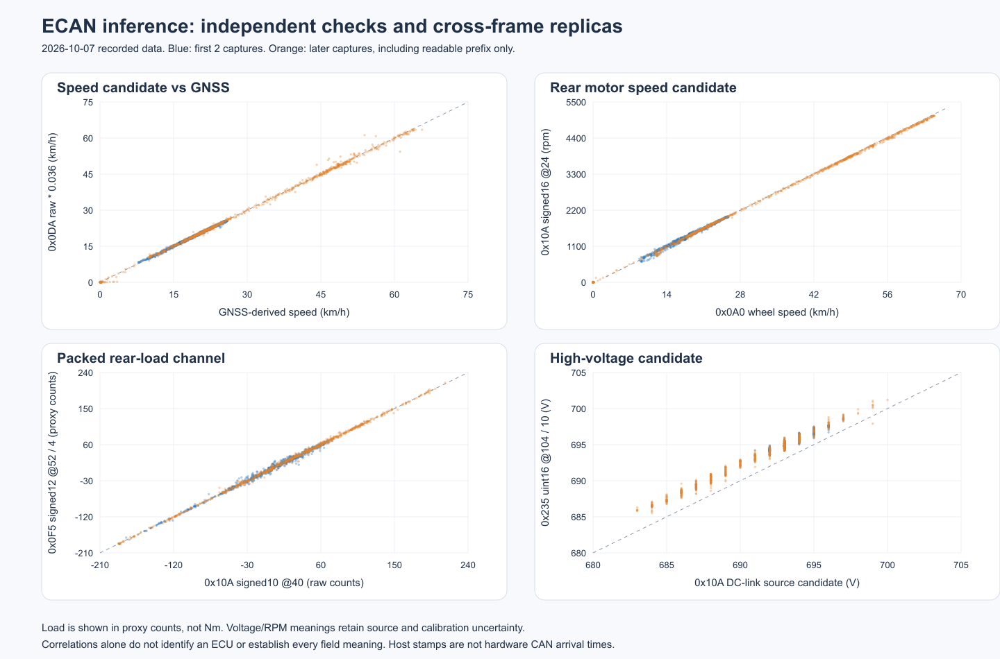

# 2026-10-07 ECAN 전 ID 추론과 값 해석

이 문서는 당시 분석 단계의 기록이다. [현재 분석 시작 문서](ecan_analysis_20261007.md)와 [최신 한국어 필드 표](ecan_korean_bit_fields_20261007.md)를 먼저 참고한다.

관측된 138개 ID 전체를 다시 검토하고 1,914,473개 프레임의 숫자 값을 ID별 파일로 만들었다. 기존 DBC 정의와 미해석 raw byte 값, 추가 추론 필드를 함께 보존했다. 정확한 기능이 특정되지 않는 ID도 누락하지 않고 가설과 근거 수준을 적었다.

이는 오프라인 연구 결과다. 모든 물리 신호의 이름과 단위를 확정했다는 뜻이 아니며 runtime DBC, firmware, 설정과 제어 코드는 변경하지 않았다. 원본 bag은 읽기만 했다. 마지막 bag은 앞선 분석과 동일하게 정상 인덱스가 남은 앞부분만 포함한다.

## 자료와 계산 범위

Exa 16개 검색 관점의 결과 요청 160건을 중복 제거해 99개 URL로 정리했다. 검색 결과 수는 읽어 검증한 독립 source 수와 다르다. 아래 8개 공개 저장소의 relevant code/DBC를 커밋으로 고정해 비교했고, 기존 opendbc와 ajouatom snapshot도 보존했다. OBD/UDS 응답 payload, 다른 차종/버스의 ID 충돌, 단순 DBC 복사 및 실차 근거 없는 이름은 그대로 ECAN에 붙이지 않았다.

| 공개 저장소 | 연구 커밋 |
| --- | --- |
| [dalathegreat/Battery-Emulator](https://github.com/dalathegreat/Battery-Emulator/tree/ef6a1b2d716c8b46e0c134d7a236afe96dd620a2) | `ef6a1b2d716c8b46e0c134d7a236afe96dd620a2` |
| [dragz/egmpdbc](https://github.com/dragz/egmpdbc/tree/b234d7e0ff5ba881f80087580d6e86cf8af447f1) | `b234d7e0ff5ba881f80087580d6e86cf8af447f1` |
| [dragz/explorationsincarhacking](https://github.com/dragz/explorationsincarhacking/tree/fddf8095e902b3e8718bb668a232912320e22926) | `fddf8095e902b3e8718bb668a232912320e22926` |
| [L1Z3/wicant-i-precondition](https://github.com/L1Z3/wicant-i-precondition/tree/2693a4e94196b2e8d796c222dd2928d1bfb1ee56) | `2693a4e94196b2e8d796c222dd2928d1bfb1ee56` |
| [openvehicles/Open-Vehicle-Monitoring-System-3](https://github.com/openvehicles/Open-Vehicle-Monitoring-System-3/tree/7c877840706624e76b8f20f9100a6dba5220342f) | `7c877840706624e76b8f20f9100a6dba5220342f` |
| [Sterlingarcher2525/ioniq5-can](https://github.com/Sterlingarcher2525/ioniq5-can/tree/8351cc0317e6cd45a286c2ed9b3d64f65336f666) | `8351cc0317e6cd45a286c2ed9b3d64f65336f666` |
| [sunnypilot/opendbc](https://github.com/sunnypilot/opendbc/tree/b2acec1dc7f15cfb258aa48415168485e29cc4ff) | `b2acec1dc7f15cfb258aa48415168485e29cc4ff` |
| [tylerharvey/Ioniq5_CAN](https://github.com/tylerharvey/Ioniq5_CAN/tree/2c08cf388ae6c8a16f32f30867b8003661bb8d79) | `2c08cf388ae6c8a16f32f30867b8003661bb8d79` |

신호 경계, byte order, signedness와 physical semantics를 따로 판단하는 접근은 [CAN-D](https://arxiv.org/abs/2006.05993), numeric/status/counter 클래스 구분은 [ByCAN](https://arxiv.org/html/2408.09265), frame matching의 한계는 [CANMatch](https://orbilu.uni.lu/bitstream/10993/48502/1/FINAL%20VERSION.pdf), multiplex 경계 문제는 [CAN-MXT](https://www.ndss-symposium.org/wp-content/uploads/vehiclesec2024-11-paper.pdf)를 참고했다. 공개 논문의 학습 모델을 그대로 재현한 것은 아니며 아래 수치 탐색과 검증은 이 로그를 위해 작성한 분석이다.

| 계산 | 범위/결과 |
| --- | --- |
| 첫 수치 탐색 | 132,334개 후보 배치 |
| 새로 찾은 부하/전압 reference로 재탐색 | 132,334개 후보 배치 |
| 1~4 bit 이산 상태 탐색 | 11,127개 필드 |
| 통과한 관계 | 첫 탐색 43, 재탐색 11, 상태 2개; 중복 reference 포함 |
| 기존 방식 CRC16 전체 일치 | 67개 ID |
| 추가 CRC8 등가 관계 전체 일치 | 8개 ID |
| 추가 해석 필드 | 30개; 복제 채널과 단위 가정 포함 |
| 프로토콜 후보 제거 뒤 본문 변화 없음 | 57개 ID |

수치 탐색은 임의 bit 시작 위치의 LE/BE, signed/unsigned 8/10/11/12/13/14/15/16/20/24/32 bit를 비교했다. 16 bit 초과는 시작 위치를 4 bit 단위로 제한했다. CRC와 counter 후보는 제외했다. 100 ms bin의 마지막 값을 사용했으며 첫 두 capture에서 후보와 -0.5~+0.5 s lag를 고르고 나머지 다섯 capture에서 확인했다. 구간별 gain, holdout 오차, 1차 차분 및 큰 time-shift 대조 수치를 남겼다. 상관계수 하나만으로 신호 이름을 확정하지 않았다.

## 독립 센서 확인

원본 bag의 NavSatFix만 인덱스로 찾아 읽었다. GPS 좌표는 공개 artifact에 넣지 않았다. GNSS position의 짧은 구간 차분으로 얻은 속도와 CAN 휠 속도를 비교하면 유효 fix와 차속 >5 km/h 조건에서 capture별 배율은 약 0.996~1.009였다. 짧고 속도 변화가 적은 capture는 상관계수가 낮을 수 있고 RTK fix라도 모든 미분값이 정밀한 것은 아니다. wheel raw x0.03125 km/h 해석은 이 독립 비교와 맞는다.



주황색은 후보 선정에 쓰지 않은 후속 capture다. 부하는 Nm가 아닌 proxy counts로 표시했다. 전압 패널은 값이 함께 변하지만 offset도 있으므로 동일한 센서라고 주장하지 않는다.

## 구체적으로 얻은 후보

| ID | 비트 배치/값 | 해석과 범위 | 근거 수준 |
| --- | --- | --- | --- |
| 0x0DA | uint16 LE 64:16, raw x0.01 m/s | 차속 후보. wheel 기준 전체 RMSE 약0.294 km/h | 독립 GNSS와 다른 capture에서도 맞음; 상위 비트 폭은 덜 자극됨 |
| 0x10A | signed16 LE 24:16 | 뒤 모터 RPM 후보, -33~5097 | 해당 차량 공개 DBC + 속도 관계; exact hardware RPM calibration 미확정 |
| 0x120 | signed16 LE 24:16 | 앞 모터 RPM 후보, -29~3862 | 공개 DBC. 뒤 모터가 돌아도 0인 구간이 있음; clutch state 자체의 증명 아님 |
| 0x10A / 0x120 | uint16 LE 128:16 | DC-link voltage 후보, 683~702 V | 공개 E-GMP source의 byte mapping + 실제 값 + 다른 전압 채널 |
| 0x035 / 0x0DA | 앞/뒤 signed load-like fields | 페달 프레임에 구동 부하 복제 후보가 있음 | motor load와 강한 관계. Nm/phase current 및 요청/피드백 역할은 미확정 |
| 0x0F5 | signed12 LE 40:12,52:12,64:12,76:12 | 두 24-bit word가 매 프레임 동일. 각 word 안에 앞/뒤 부하 후보가 있음 | 전체 raw duplicate 확인. /4는 MCU load 비교용 proxy scale, Nm 확정 아님 |
| 0x065 | 200:12,212:12의 양수값 x8 | 앞/뒤 모터 RPM 압축 복제 후보 | 각각 source RPM과 약1/8 관계. sign/상위 폭과 신호 역할은 덜 자극됨 |
| 0x2B5 | uint8 LE 48:8 | 가속 페달 raw 복제 후보, 0~112 | 별도 capture r>0.999, 근접 stamp 6567 pair 중82.78% exact |
| 0x235 / 0x255 | uint16 LE 104:16 /136:16, /10 | 고전압 후보 685.5~701.3 /682.1~698.7 V | 같은 전압 계열과 함께 변함; sensor 위치 및 absolute calibration 미확정 |
| 0x250 / 0x2FA | signed10 LE 168:10 /signed16 LE 64:16 | 전력/전류성 부하 후보, raw -56~47 /-759~698 | 전력 proxy와 높은 관계. kW 및 raw/10 A는 joint working unit hypothesis |
| 0x1AA | byte6 raw x0.125 m/s 가정 | 속도 복제/필터 후보 | 강한 관계, best alignment 약0.3 s. scale 가정 RMSE 약1.52 km/h |
| 0x435 | byte7 unsigned, 1 km/h/LSB 후보 | 필터/표시 속도 후보 0~64 | 해당 차량 DBC + speed/GNSS. 다른 source의 Power_State 해석은 이 로그의 변화와 맞지 않음 |

12-bit packed 분해는 부하 word 전체를 단일 signed24 quantity로 간주하는 대안을 수정한 결과다. 0x0F5의 5~7 B와 8~10 B는 모든 65,686개 기록에서 동일하지만, 그 안의 앞/뒤 채널은 서로 다르게 움직인다. raw word를 단일 물리량으로 이름 붙이지 않았다.

## 채택하지 않은 가정

- 조향 센서 값과 MDPS 추정각은 source에 따라 부호가 다르다. 실제 0x0EA bits128..143의 raw x-0.1이 0x125 각도와 가깝지만 좌/우 물리 방향까지 새로 확정하지 않았다.
- 공개 DBC의 0x412 byte6 브레이크 해석은 해당 byte가 고정인 반면 실제 brake flag는 변하므로 이 capture에서 확인되지 않는다.
- 오래된 0x386 wheel-speed 정의는 본문이 고정이어서 움직이는 실제 wheel-speed와 맞지 않는다. ID/길이 일치만으로 적용하지 않는다.
- TPMS 타이어 순서는 자료 간 FL/FR, RL/RR가 다르다. 물리적 타이어 위치를 표시한 별도 측정이 없어 source별 대안을 유지했다.
- motor load raw=1 Nm/count, current raw=0.1 A/count를 동시에 가정한 drive-side 전력 모델은 전기 입력이 기계 출력보다 작게 계산되어 채택하지 않았다. 전류 후보의 A 변환은 별도 가정으로 표시했다.
- 모터 RPM 적분에 맞는 cyclic phase 후보를 902개 비교했지만 선택한 모델을 통과한 것은 없었다. rotor angle이라는 이름을 임의로 붙이지 않았다.
- 표준적인 fixed-seed contiguous CRC16 region/polynomial 가설은 여섯 32 B 미해석 header에서 통과하지 않았다. 양방향 각32768개 polynomial 및4개 data region을 비교했다. checksum이 없다는 증명은 아니며 seed/encoding/보호 방식이 더 복잡할 수 있다.

## 모든 ID와 값 파일

[138개 ID의 개별 가설 및 필드](ecan_inference_all_ids_20261007.md)에 각 ID의 기능 후보, 근거, 상태/수치 클래스, 관계, 필드 범위 및 confidence를 적었다. 근거가 없는 ID에는 구체적인 ECU/물리 단위를 만들지 않았다.

ID별 NPZ 파일은 exact int64 `stamp_ns`, `capture_index`, `values` matrix를 담고 schema.json은 column 이름, bit 배치, transform, 단위와 confidence를 담는다. 모든 관측 ID와 기록을 포함했다. 미해석 bytes도 unsigned raw로 읽을 수 있고 known identifier 값은 생략했다. conditional navigation event는 source 조건 밖에서 NaN이다.

값 bundle은 프로젝트의 ignored build 아래 `deep-ecan-20261007/ecan_decoded_values_20261007.zip`에 있다. Git/public artifact에 raw dataset를 넣지 않았다. Python3.8+와 NumPy가 있는 환경에서 ZIP의 read_values.py로 읽을 수 있으며 이 분석에서는 시스템 패키지를 설치하지 않았다.

```bash
python read_values.py --id 0x10A --limit 5
python read_values.py --id 0x0DA --fields VEHICLE_SPEED_MPS_CANDIDATE --limit 5
```

예를 들어 첫 0x10A 프레임은 source 해석 기준 RPM 후보1538, DC-link voltage 후보694 V, motor load raw -12다. 이는 2026-10-07 기록의 값이며 현재 차량 상태가 아니다.

모든 ID의 숫자와 가설은 제공했지만 57개 본문은 관측에서 변화하지 않았다. 일정한 bit에 어떤 함수/단위를 붙여도 같은 기록을 설명할 수 있으므로, 반복 계산만으로 고유한 기능 이름을 확정할 수 없다. 그 ID는 고정 상태/비활성/설정 후보라는 일반 클래스와 raw 값까지 해석한 상태로 남긴다. 변하는 ID도 독립 reference가 없으면 온도/전압/명령/피드백 대안이 남는다.

전체 계산 source와 intermediate는 workspace-local build/deep-ecan-20261007에 보존했다. [Deep JSON](evidence/2026-10-07/ecan-deep-inference-20261007.json)과 [인터넷 source audit](evidence/2026-10-07/ecan-internet-source-audit-20261007.json)은 숫자 근거와 provenance를 보존한다.
